# DSO202 Assignment 2: Applying Unit II to the Task Tracker

<!-- There wasn't a proper brief for this one, just one line on the portal: "utilize the concepts and knowledge gained from the Unit 2 lectures to effectively implement Assignment 1." So instead of guessing at a rubric, I used the module descriptor topic list itself as my checklist (2.1 through 2.4, down to the numbered sub-points), and made sure every single one of them is either actually built and evidenced in the cluster, or written up properly with a reason why it's written and not built. I've kept the same numbering in this report so it's easy to check off against the descriptor directly. -->

This builds on my Assignment 1 app, not a new one — same task tracker, same three tiers, same namespace. I'm not repeating A1's own README here (ConfigMap/Secret setup, the arm64 image issue, the original CRUD evidence); that's all still true and still submitted separately. This document only covers what changed for A2.

> Before submitting: read this whole thing over and put it in your own words where it still sounds like me explaining something rather than describing it. Check every screenshot filename below against what's actually in `evidence/`.

## 1. What changed structurally

I copied `assignment-1/` to `assignment-2/` rather than editing A1's files, so A1 stays exactly as submitted. The kind cluster also had to be rebuilt from scratch, because kind's port mappings are fixed at cluster creation and Ingress needs host ports 80/443 mapped in, plus the node labelled `ingress-ready=true`. I kept the old NodePort mapping (30080) too, mostly so I could still compare against it if needed, even though the frontend doesn't use it anymore once Ingress is in.

```yaml
kind: Cluster
apiVersion: kind.x-k8s.io/v1alpha4
nodes:
  - role: control-plane
    kubeadmConfigPatches:
      - |
        kind: InitConfiguration
        nodeRegistration:
          kubeletExtraArgs:
            node-labels: "ingress-ready=true"
    extraPortMappings:
      - containerPort: 30080
        hostPort: 30080
        protocol: TCP
      - containerPort: 80
        hostPort: 80
        protocol: TCP
      - containerPort: 443
        hostPort: 443
        protocol: TCP
```

Recreating the cluster didn't touch my A1 submission at all, that's already committed and pushed. It only affects the local cluster I'm working in now.

The images are still my own amd64 rebuilds (`pdolker/dso202-{frontend,backend,db}:1.0`), for the same reason as A1 — the tutor's `sarojsanyasi/...` images are arm64-only on Docker Hub, which I checked again on this cluster and hasn't changed. Every `image:` line still carries the `# TEMP` comment from A1.

## 2.1 StatefulSets

### 2.1.1 Use cases for StatefulSets

A1 deliberately used a Deployment with a manually-created PVC for the database, because at one replica that's simpler and does the job. The reason to reach for a StatefulSet instead is when replicas aren't interchangeable — each one needs its own stable name, its own stable network address, and usually its own storage that follows it around if it gets rescheduled. A Deployment doesn't track any of that; any replica can vanish and be replaced by an identical stranger with a random name. That's fine for a stateless API, but not for something like a database cluster where each node needs to know who it is.

### 2.1.2 Deploying stateful applications

I converted `db` from a Deployment to a StatefulSet. The migration meant deleting the old Deployment and its manually-created `db-pvc`, then applying the StatefulSet, which generates its own PVC through a template. This loses the old seed data, but that's not actually a problem here — the postgres image reseeds the three sample tasks automatically the first time it starts against an empty volume, since the init script only runs once, on a genuinely empty data directory.

```yaml
apiVersion: apps/v1
kind: StatefulSet
metadata:
  name: db
  namespace: dso202-assignment-01
spec:
  serviceName: db-svc
  replicas: 1
  podManagementPolicy: OrderedReady
  selector:
    matchLabels: { app: task-tracker, tier: database }
  template:
    metadata:
      labels: { app: task-tracker, tier: database }
    spec:
      containers:
        - name: postgres
          image: pdolker/dso202-db:1.0
          env:
            - { name: POSTGRES_DB, valueFrom: { configMapKeyRef: { name: app-config, key: POSTGRES_DB } } }
            - { name: POSTGRES_USER, valueFrom: { secretKeyRef: { name: db-credentials, key: POSTGRES_USER } } }
            - { name: POSTGRES_PASSWORD, valueFrom: { secretKeyRef: { name: db-credentials, key: POSTGRES_PASSWORD } } }
          volumeMounts:
            - { name: data, mountPath: /var/lib/postgresql/data }
  volumeClaimTemplates:
    - metadata: { name: data }
      spec:
        accessModes: ["ReadWriteOnce"]
        storageClassName: standard
        resources: { requests: { storage: 1Gi } }
  updateStrategy: { type: RollingUpdate }
  persistentVolumeClaimRetentionPolicy:
    whenDeleted: Retain
    whenScaled: Delete
```

I kept `replicas: 1` for the app I'm actually running. A plain `postgres` container has no replication logic in it — it doesn't know how to be a primary or a follower, doesn't sync data with anything, nothing. If I ran this at 3 replicas permanently, I wouldn't have a database cluster, I'd have three completely separate databases that happen to share a name pattern. I proved this directly rather than just asserting it (see 2.1.2.2), and I think that's a more honest way to demonstrate the concept than pretending three replicas gives you something it doesn't.

`whenDeleted: Retain` and `whenScaled: Delete` were a deliberate pair, not defaults I left alone. If I ever scale a replica down (which I do, for the scaling demo below), its data gets cleaned up automatically since it was only ever a throwaway extra copy. But if I ever delete the whole StatefulSet by accident, the real data stays.

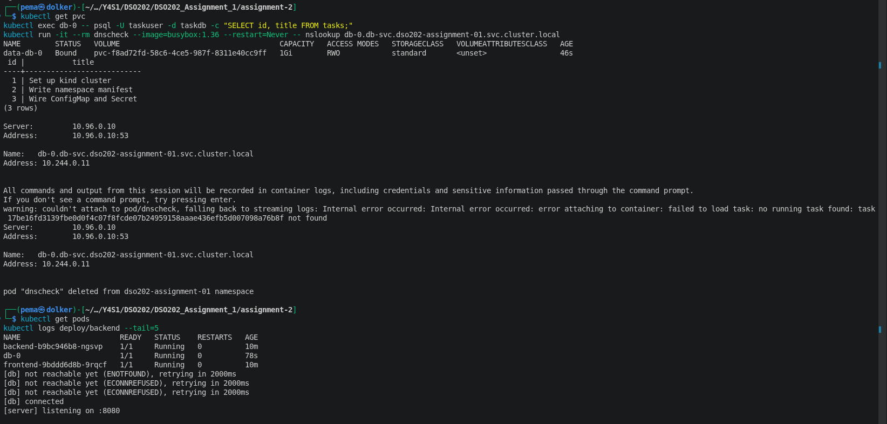

### 2.1.2.1 Stable network identities

```bash
kubectl exec db-0 -- psql -U taskuser -d taskdb -c "SELECT id, title FROM tasks;"
kubectl run -it --rm dnscheck --image=busybox:1.36 --restart=Never -- \
  nslookup db-0.db-svc.dso202-assignment-01.svc.cluster.local
```

`db-0` is a Pod name, not a random suffix like `db-564c5c7db4-5v56k` from A1's Deployment. `nslookup` resolved `db-0.db-svc...` straight to `10.244.0.11`, the Pod's own IP, not a Service's shared virtual IP. That's the headless Service (already headless from A1, no changes needed there) giving each StatefulSet Pod its own individual, predictable DNS name.

### 2.1.2.2 Ordered deployment and scaling

```bash
kubectl scale statefulset db --replicas=3
kubectl get pods -l tier=database --watch
```

`db-1` didn't start until `db-0` was already `Running` and `1/1`, and `db-2` didn't start until `db-1` was ready — strictly one at a time, in order. Scaling back down reversed it: `db-2` terminated first, then `db-1`, leaving only `db-0`.

I also proved the three replicas really are independent databases, not a cluster:

```bash
kubectl exec db-0 -- psql -U taskuser -d taskdb -c "INSERT INTO tasks (title, status) VALUES ('only in db-0', 'pending');"
kubectl exec db-1 -- psql -U taskuser -d taskdb -c "SELECT id, title FROM tasks;"
kubectl exec db-2 -- psql -U taskuser -d taskdb -c "SELECT id, title FROM tasks;"
```

Neither `db-1` nor `db-2` had the row I only inserted into `db-0`. That's the concrete version of the point I made in 2.1.1 — nothing was syncing between them, because nothing in the image knows how to sync anything.

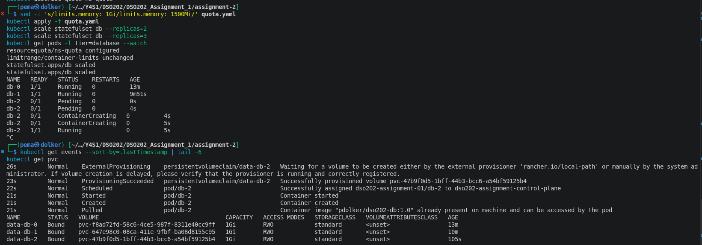
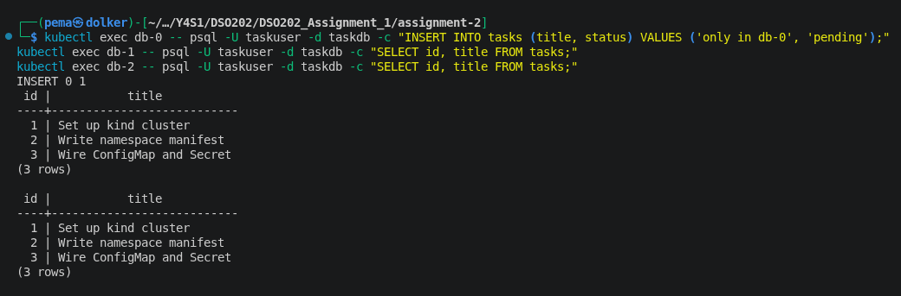
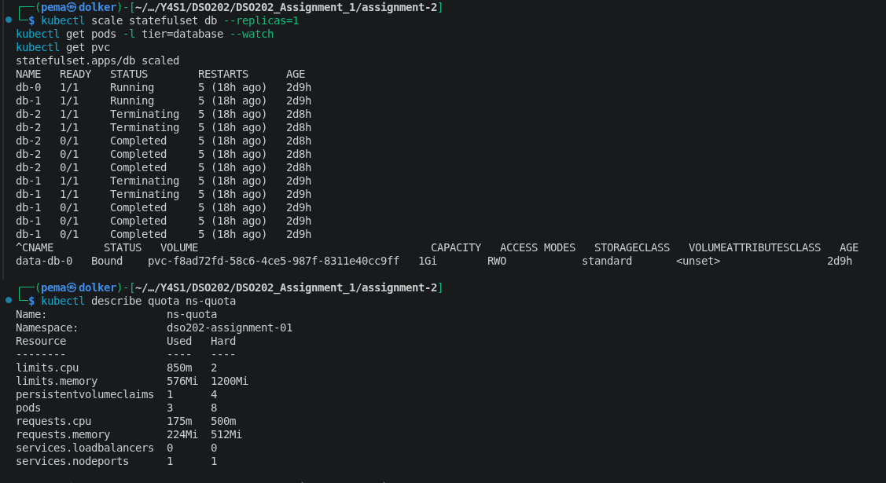

### 2.1.3 Headless Services for StatefulSets

`db-svc` was already `clusterIP: None` from A1 — nothing needed to change here, since A1's own reasoning for it (a stable in-namespace name for the database, nothing external) already matched what a StatefulSet needs. I just had to reference it in the StatefulSet's `serviceName` field, which is what actually connects the two and makes the per-Pod DNS names in 2.1.2.1 exist at all. Without that field pointing at a genuinely headless Service, none of that DNS behaviour happens.

### 2.1.4 Volume claim templates

Instead of one PVC I create by hand and mount, `volumeClaimTemplates` makes Kubernetes generate one distinct PVC per replica automatically, named `data-<pod-name>`. So scaling to 3 replicas produced `data-db-0`, `data-db-1`, `data-db-2`, each 1Gi, each bound independently. If a Pod gets rescheduled, it reattaches to its own same-named PVC rather than getting a blank one — I didn't specifically test a reschedule-and-reattach, but it follows directly from the naming being tied to the ordinal, and A1's self-healing test already showed PVC-and-Pod-lifecycle-independence in the simpler single-replica case.

One thing that genuinely tripped me up here, worth including honestly: scaling to 3 replicas hit my own A1 ResourceQuota, twice, from two different angles.

```text
persistentvolumeclaims "data-db-2" is forbidden: exceeded quota: ns-quota,
requested: persistentvolumeclaims=1, used: persistentvolumeclaims=2, limited: persistentvolumeclaims=2
```

I raised `persistentvolumeclaims` to 4, and `db-2` still didn't appear — the StatefulSet controller doesn't watch the ResourceQuota, so fixing the quota alone doesn't make it retry on its own; I had to scale down and back up to force a fresh attempt. That's when the second wall showed up:

```text
pods "db-2" is forbidden: exceeded quota: ns-quota,
requested: limits.memory=256Mi, used: limits.memory=832Mi, limited: limits.memory=1Gi
```

I worked out the actual peak rather than guessing a number: `db` at 3 replicas plus `backend` plus `frontend` comes to 1850m CPU / 1088Mi memory at the top of a scaling test. I set `limits.memory` to 1200Mi — tight enough that it's clearly sized from that number, not picked at random — and `persistentvolumeclaims` to 4 (3 real replicas plus one spare). `limits.cpu` didn't need to change; A1's `2` already covered the 1850m peak.


## 2.2 Ingress and Ingress Controllers

### 2.2.1 Ingress resource configuration

The frontend went from A1's NodePort to a single Ingress object handling both routing and TLS. This is the actual point of Ingress existing: one entry point instead of one NodePort per app.

```yaml
apiVersion: networking.k8s.io/v1
kind: Ingress
metadata:
  name: task-tracker-ingress
  namespace: dso202-assignment-01
  annotations:
    nginx.ingress.kubernetes.io/limit-rps: "5"
spec:
  ingressClassName: nginx
  tls:
    - hosts: [tasktracker.local, api.tasktracker.local]
      secretName: tasktracker-tls
  rules:
    - host: tasktracker.local
      http:
        paths:
          - { path: /api, pathType: Prefix, backend: { service: { name: backend-svc, port: { number: 8080 } } } }
          - { path: /,    pathType: Prefix, backend: { service: { name: frontend-svc, port: { number: 8080 } } } }
    - host: api.tasktracker.local
      http:
        paths:
          - { path: /, pathType: Prefix, backend: { service: { name: backend-svc, port: { number: 8080 } } } }
```

The lecture notes' own worked example uses a `rewrite-target: /` annotation, which I deliberately left out. That annotation strips the matched path down to `/` before forwarding — fine for a backend that expects bare paths, wrong for mine, since my backend's actual routes are `/api/tasks`, `/api/status` and so on. Copying the example as-is would have broken every API call by rewriting `/api/tasks` down to just `/`. I checked the assumption behind the example against my own backend before using it, rather than pasting it in and finding out later.

With Ingress doing the external exposure, `frontend-svc` doesn't need its own NodePort any more, so I switched it to plain `ClusterIP`.

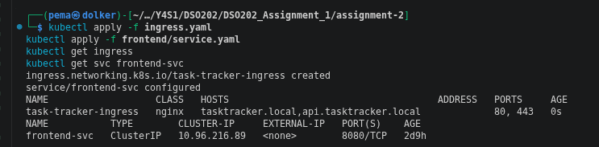

### 2.2.1.1 Basic routing rules

```bash
curl -sk https://tasktracker.local/api/status
curl -sk https://tasktracker.local/ | head -3
```

`/api/status` returned the backend's JSON, `/` returned the frontend's HTML — same host, same port, routed to two different Services purely by path.

### 2.2.1.2 TLS termination

There's no real domain for a kind cluster, so I generated a self-signed certificate for both hostnames and put it in a `kubernetes.io/tls` Secret:

```bash
openssl req -x509 -nodes -days 365 -newkey rsa:2048 \
  -keyout tasktracker.key -out tasktracker.crt \
  -subj "/CN=tasktracker.local/O=dso202" \
  -addext "subjectAltName=DNS:tasktracker.local,DNS:api.tasktracker.local"
kubectl create secret tls tasktracker-tls --cert=tasktracker.crt --key=tasktracker.key -n dso202-assignment-01
```

Both `curl` tests above went over `https://`, with `-k` to accept the self-signed cert (without it curl refuses to connect at all, which is the expected, correct behaviour for a cert nothing trusts by default). The encryption and decryption both happen at the Ingress controller — the frontend and backend Pods behind it never see TLS at all, they're still plain HTTP internally.

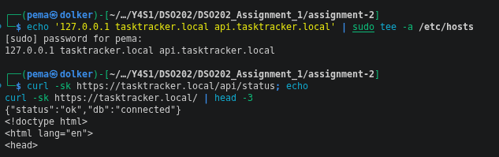

### 2.2.1.3 Name-based virtual hosting

`tasktracker.local` and `api.tasktracker.local` both resolve to the same address on my machine (I added both to `/etc/hosts` pointing at `127.0.0.1`), but the Ingress routes them completely differently — one serves the full app, the other serves backend only, at `/`. Same IP, same port, different content, purely from the `Host` header:

```bash
curl -sk https://tasktracker.local/api/status
curl -sk https://api.tasktracker.local/api/status
```

Both return the same backend JSON, which is exactly what should happen — `api.tasktracker.local` routes everything at `/` straight to the backend, so `/api/status` reaches the same place either way, just through a different rule.

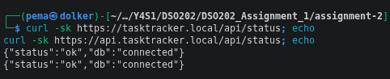

### 2.2.2 Setting up Ingress Controllers

#### 2.2.2.1 NGINX Ingress Controller

I installed this using kind's own dedicated manifest (not the generic cloud one), since it's built specifically to work with kind's `hostPort` setup rather than needing a real cloud LoadBalancer:

```bash
kubectl apply -f https://raw.githubusercontent.com/kubernetes/ingress-nginx/main/deploy/static/provider/kind/deploy.yaml
kubectl wait --namespace ingress-nginx --for=condition=ready pod \
  --selector=app.kubernetes.io/component=controller --timeout=180s
```

This actually failed on the first attempt — `kubectl wait` timed out after 180 seconds. I didn't just rerun it, I checked why with `kubectl describe pod`, and found two separate things, in sequence, neither of which was a real problem: a harmless `FailedMount: secret "ingress-nginx-admission" not found` for the first few minutes (a known kind race, where the controller Pod gets scheduled slightly before the webhook setup job creates the cert it needs — it resolves on its own), and then the controller image itself taking 2m54s to pull, which is what actually blew past my 180-second timeout. Once the pull finished, the container started fine.

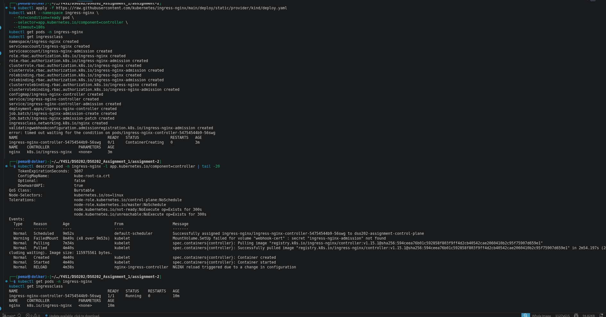

#### 2.2.2.2 Traefik Ingress Controller

I didn't install Traefik alongside NGINX — running two Ingress controllers in one small cluster for one small app isn't something a real team would do just to tick a syllabus box, so I've written this up instead, based on the lecture notes and what I know of both.

Traefik and the NGINX Ingress Controller solve the same problem — routing external HTTP(S) traffic into the cluster at Layer 7 — but differ in a few real ways. Traefik is written in Go and ships its own native CRDs (`IngressRoute` and others) alongside standard support for the plain Kubernetes `Ingress` object, so it can express routing rules that the base `Ingress` spec genuinely can't, without needing controller-specific annotations for everything. It also has a built-in dashboard for watching live routing state, and automatic Let's Encrypt certificate handling built directly into the controller, rather than needing a separate tool like cert-manager. Annotation-based features work the same way conceptually as NGINX's, just with a different prefix (`traefik.ingress.kubernetes.io/...` instead of `nginx.ingress.kubernetes.io/...`), which is exactly what the notes mean by annotations being controller-specific and never portable between controllers.

The choice between them matters more right now than it would have a year ago. The lecture notes flag that the NGINX Ingress Controller — the one I actually used here, and the most widely deployed historically — entered maintenance mode as of 2026, with no further releases, bug fixes or security updates from March 2026 onward. I used it anyway for this assignment because it's what the notes' own worked example is built around and it's the best-documented option for kind specifically, but I'm aware that a real team making this decision today would need to weigh that against Traefik or the newer Gateway API as the longer-term choice, not just default to NGINX out of habit.

### 2.2.3 Ingress annotations for controller-specific features

I used `nginx.ingress.kubernetes.io/limit-rps: "5"`, which caps each client IP to 5 requests per second. I wanted to actually trigger it, not just declare it and hope, so I hit it with load:

```bash
for i in $(seq 1 40); do curl -sk -o /dev/null -w "%{http_code}\n" https://tasktracker.local/api/status; done | sort | uniq -c
```

28 came back `200`, 12 came back `503`. A smaller first attempt at 10 requests hadn't been enough to trigger it at all — `limit_req` tolerates some burst above the stated rate, so a handful of polite requests can slip through entirely. I checked the rendered NGINX config too, to confirm the annotation had actually produced a real `limit_req_zone` and I wasn't just getting lucky with the numbers.

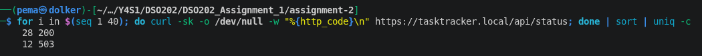

## 2.3 Kubernetes RBAC

A1's Task 8 (the optional bonus) only covered one Role bound to one ServiceAccount for read-only namespace access. This section goes further: Role vs ClusterRole, aggregation specifically, and binding to all three kinds of subject the descriptor names — users, groups, and service accounts — not just service accounts.

### 2.3.1 Roles and ClusterRoles

#### 2.3.1.1 Defining permissions for resources

I gave the backend its own dedicated ServiceAccount and Role, replacing the namespace's default ServiceAccount it was running as before (which the lecture notes specifically call out as something to avoid — permissions granted to the default SA are silently shared by everything in the namespace that doesn't ask for a different one):

```yaml
apiVersion: rbac.authorization.k8s.io/v1
kind: Role
metadata:
  name: backend-role
  namespace: dso202-assignment-01
rules:
  - apiGroups: [""]
    resources: ["pods"]
    verbs: ["get", "list"]
```

I'll be honest about this one rather than inventing a justification: my backend doesn't currently call the Kubernetes API for anything, it's a REST server talking to Postgres. This Role and ServiceAccount exist to demonstrate the mechanism properly, not because the app needs it today — and I picked read-only access to Pods specifically because it sets up a clean, honest contrast in 2.3.3.2.

#### 2.3.1.2 Aggregated ClusterRoles

This was the one genuinely new mechanic for me. Kubernetes' built-in `edit`, `view` and `admin` ClusterRoles aren't fixed lists — they carry a label selector, and the API server automatically merges in the rules of any ClusterRole matching that selector. To prove this properly rather than just describing it, I needed something `edit` genuinely didn't cover yet, and since `edit` already covers almost every built-in resource, that meant using a real CRD (`TaskTrackerBackup`, which I also reuse for the Operators section below — a CRD is guaranteed to start at zero permissions until something explicitly extends a role to cover it).

```yaml
apiVersion: rbac.authorization.k8s.io/v1
kind: ClusterRole
metadata:
  name: tasktrackerbackup-editor
  labels:
    rbac.authorization.k8s.io/aggregate-to-edit: "true"
rules:
  - apiGroups: ["dso202.example.com"]
    resources: ["tasktrackerbackups"]
    verbs: ["get", "list", "watch", "create", "update", "patch", "delete"]
```

Before creating this, `pema` (bound to the built-in `edit` ClusterRole via a RoleBinding scoped to my namespace) got `no` when I checked whether she could create a `tasktrackerbackup`. The moment I applied the small ClusterRole above — with nothing anywhere touching `edit` itself — the same check returned `yes`. I checked the mechanism directly too, not just the effect:

```bash
kubectl get clusterrole edit -o jsonpath='{.aggregationRule}'
kubectl get clusterrole edit -o jsonpath='{.rules[?(@.apiGroups[0]=="dso202.example.com")]}'
```

The first line showed `edit`'s selector, which is exactly the label my small ClusterRole carries. The second showed my `tasktrackerbackups` rule already merged into `edit`'s own rule list. Nobody ran `kubectl edit clusterrole edit` anywhere — that's the entire point of the mechanism.

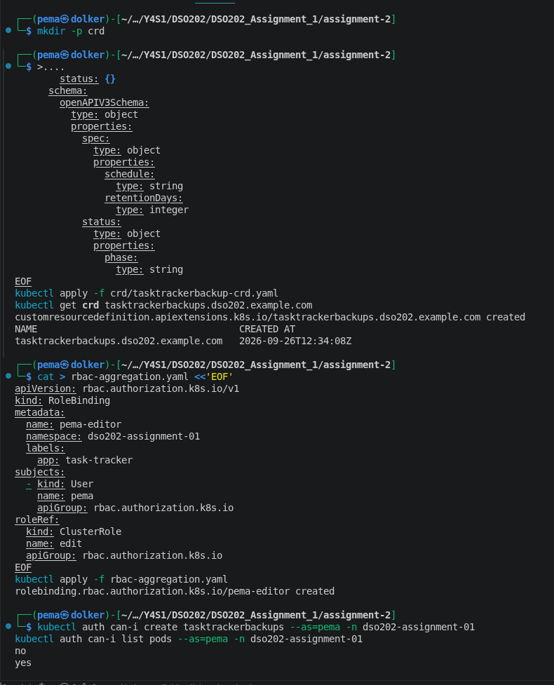
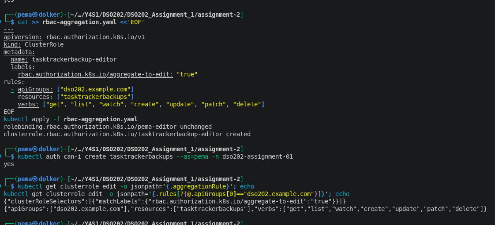

### 2.3.2 RoleBindings and ClusterRoleBindings

#### 2.3.2.1 Binding roles to users, groups, and service accounts

Kubernetes has no `User` object — "creating a user" really means minting a certificate the API server trusts, then binding a Role to the identity inside it. I generated one for myself:

```bash
openssl genrsa -out pema.key 2048
openssl req -new -key pema.key -out pema.csr -subj "/CN=pema/O=dso202-students"
```

then got it signed through the cluster's own CSR API, using the exact signer the API server actually accepts for client authentication (`kubernetes.io/kube-apiserver-client` — a different signer name silently produces a certificate nothing will accept):

```bash
kubectl apply -f pema-csr.yaml   # CertificateSigningRequest wrapping the base64'd CSR
kubectl certificate approve pema
```

`CN=pema` became my username, bound directly:

```bash
kubectl create rolebinding pema-reader --namespace=dso202-assignment-01 --role=namespace-reader --user=pema
```

Then I switched into that identity properly, through a real kubeconfig context, not just `--as=`, and ran the same before/after style check A1's Task 8 used, extended a bit:

```bash
kubectl config use-context pema-context
kubectl get pods          # works
kubectl get secrets       # Forbidden — not in the Role
kubectl get pods -n kube-system   # Forbidden — RoleBinding is namespace-scoped
kubectl get nodes         # Forbidden — cluster-scoped, a Role could never cover it anyway
```

That last error message was more informative than I expected — Kubernetes itself said `Forbidden ... at the cluster scope`, not just refusing generically.

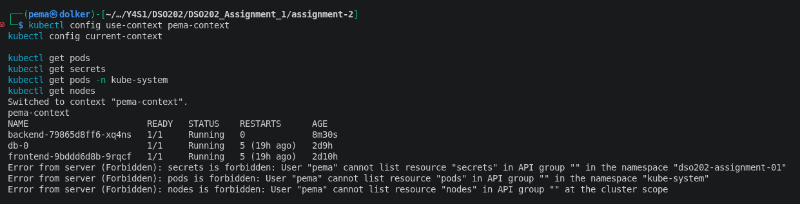

For groups, I minted a second identity, `CN=classmate-demo`, in the same `O=dso202-students` group, and gave it **no personal binding at all** — only a group binding:

```bash
kubectl create rolebinding dso202-students-reader --namespace=dso202-assignment-01 --role=namespace-reader --group=dso202-students
```

Switching into `classmate-demo`'s context and running `kubectl get pods` worked, even though that exact identity is never named in any RoleBinding, only the group it happens to belong to.

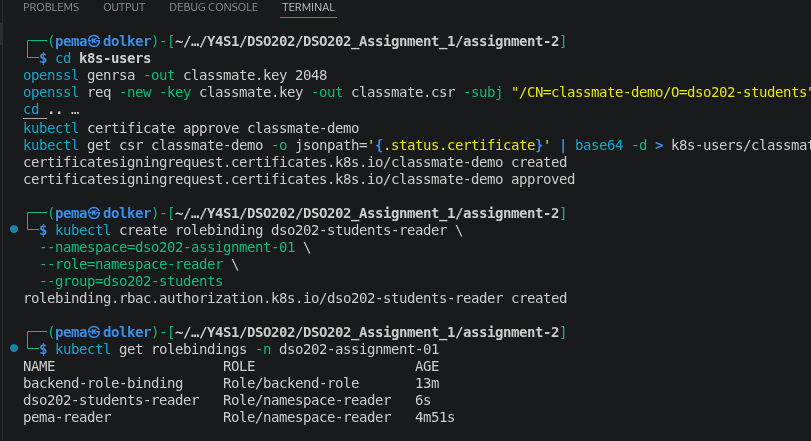
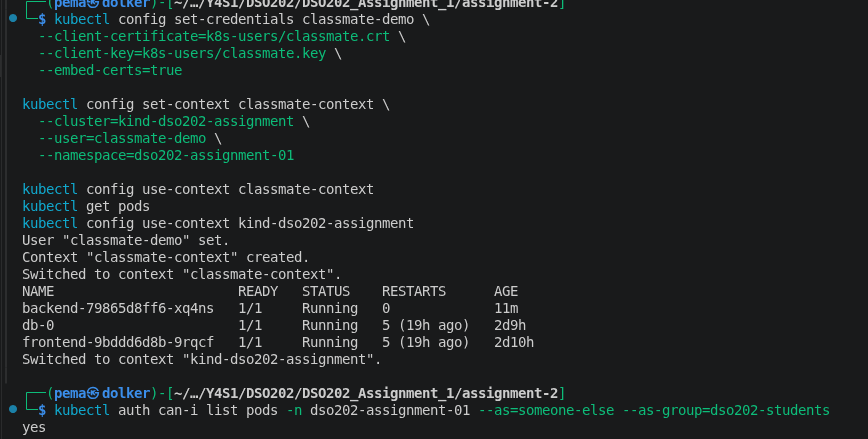

Both of those bindings are RoleBindings, though, which are namespace-scoped by nature. To actually cover the "ClusterRoleBinding" half of this section's own title, I bound the same `dso202-students` group to the built-in `view` ClusterRole, cluster-wide:

```bash
kubectl get pods -n kube-system --as=classmate-demo   # Forbidden, before
kubectl create clusterrolebinding dso202-students-viewer-clusterwide --clusterrole=view --group=dso202-students
kubectl get pods -n kube-system --as=classmate-demo   # works, after
```

The first time I tried this it still failed, and it's worth including why: `--as=classmate-demo` only impersonates the username, not the group. Kubernetes has no stored directory of users and their groups anywhere — group membership only lives inside a certificate itself, which is what actually happens automatically when I switch into a real kubeconfig context. Impersonation with plain `--as=` doesn't carry that, so I had to add `--as-group=dso202-students` explicitly for the check to reflect the real binding:

```bash
kubectl get pods -n kube-system --as=classmate-demo --as-group=dso202-students
```

With the group included, `classmate-demo` could now list every control-plane Pod in `kube-system` — CoreDNS, etcd, the API server, kube-proxy, all of it — none of which was reachable a moment earlier. `default` came back "No resources found," which isn't a failure, that's an empty namespace; the permission check passed, there's just nothing there to list. That distinction (Forbidden vs. genuinely empty) looks similar at a glance but means opposite things, and I only really understood that by getting it wrong first.

That's the actual, concrete difference between the two binding types — the identical group, blocked one way, cluster-wide the other, purely because of which binding object it went through.

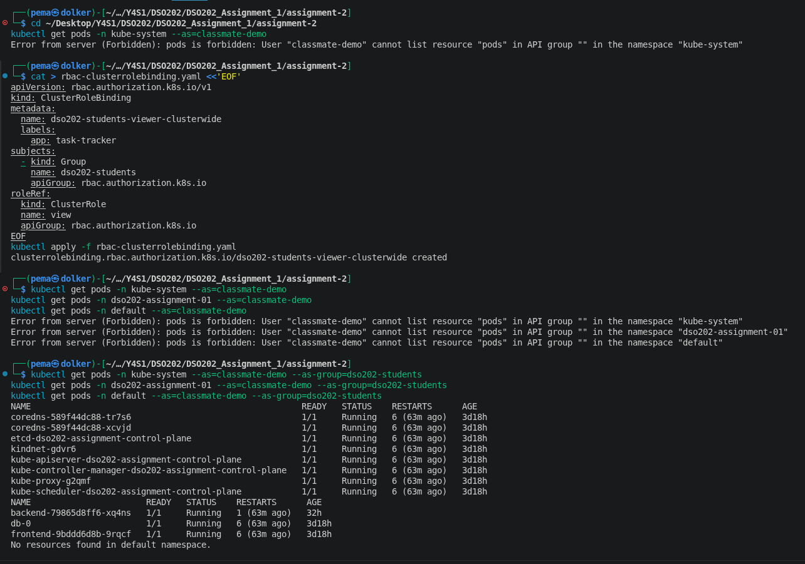

### 2.3.3 Service Accounts

#### 2.3.3.1 Creating and managing service accounts

`backend-sa` is created above (2.3.1.1). Attaching it to the backend Deployment needed one line:

```yaml
spec:
  template:
    spec:
      serviceAccountName: backend-sa
```

A Pod's ServiceAccount is only set when it's created, so changing this on an existing Deployment doesn't apply until the Pod restarts:

```bash
kubectl rollout restart deployment/backend
kubectl get pod -l tier=backend -o jsonpath='{.items[0].spec.serviceAccountName}'
```

confirmed `backend-sa`, not `default`.

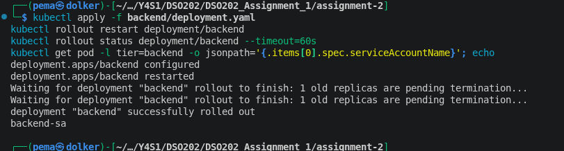

#### 2.3.3.2 Using service accounts for pod authentication

The quick way to check this is asking Kubernetes hypothetically what an identity *could* do:

```bash
kubectl auth can-i list pods --as=system:serviceaccount:dso202-assignment-01:backend-sa -n dso202-assignment-01   # yes
kubectl auth can-i get secrets --as=system:serviceaccount:dso202-assignment-01:backend-sa -n dso202-assignment-01 # no
```

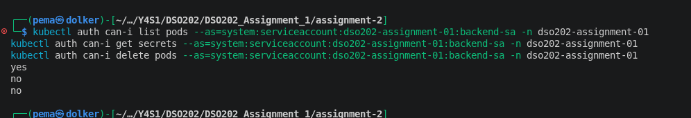

But I wanted to prove it properly — actually running as that identity and hitting the real API server with the exact token Kubernetes mounts into a Pod, not a hypothetical check from outside. I launched a short-lived Pod using `backend-sa` and made it read its own mounted token to authenticate directly:

```bash
kubectl run debug-as-backend --rm -i --image=curlimages/curl --restart=Never \
  --overrides='{"spec": {"serviceAccountName": "backend-sa"}}' \
  -- sh -c '
TOKEN=$(cat /var/run/secrets/kubernetes.io/serviceaccount/token)
curl -sk -o /dev/null -w "HTTP %{http_code}\n" -H "Authorization: Bearer $TOKEN" https://kubernetes.default.svc/api/v1/namespaces/dso202-assignment-01/pods
curl -sk -o /dev/null -w "HTTP %{http_code}\n" -H "Authorization: Bearer $TOKEN" https://kubernetes.default.svc/api/v1/namespaces/dso202-assignment-01/secrets
'
```

`HTTP 200` on Pods, `HTTP 403` on Secrets. This is worth sitting with for a second: this is the exact same RBAC check running on a genuine request, from inside a real Pod, using its own real mounted credential — not a simulation of what would happen. And it's a nice contrast with how the backend actually gets its database password in the first place (as an environment variable, injected from a Secret at container start) versus what its own API identity is allowed to read directly (nothing from Secrets, ever) — two completely different access paths to the same kind of data.

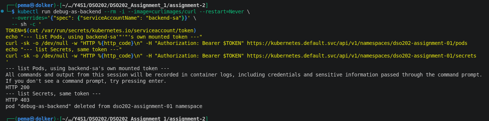

## 2.4 Kubernetes Operators

### 2.4.1 Operator pattern

The Operator pattern is about packaging application-specific operational knowledge — how to fail over, back up, upgrade a specific piece of software — into a controller that watches a Custom Resource and drives the real cluster state to match it, the same reconcile-loop idea every built-in Kubernetes controller already runs on, just with logic specific to one application rather than to Kubernetes itself.

#### 2.4.1.1 Custom Resources and Custom Resource Definitions

I made a real CRD for my own app, `TaskTrackerBackup` — representing what a future backup-request object for the task tracker's database might look like — and reused it here and in the aggregation demo above:

```yaml
apiVersion: apiextensions.k8s.io/v1
kind: CustomResourceDefinition
metadata:
  name: tasktrackerbackups.dso202.example.com
spec:
  group: dso202.example.com
  names: { kind: TaskTrackerBackup, plural: tasktrackerbackups, singular: tasktrackerbackup }
  scope: Namespaced
  versions:
    - name: v1
      served: true
      storage: true
      subresources: { status: {} }
      schema:
        openAPIV3Schema:
          type: object
          properties:
            spec:
              type: object
              properties: { schedule: { type: string }, retentionDays: { type: integer } }
            status:
              type: object
              properties: { phase: { type: string } }
```

Then a real instance of it:

```yaml
apiVersion: dso202.example.com/v1
kind: TaskTrackerBackup
metadata:
  name: nightly-backup
  namespace: dso202-assignment-01
spec:
  schedule: "0 2 * * *"
  retentionDays: 7
```

The point I wanted to actually prove, not just state, is that a CRD alone does nothing. `kubectl apply` and `kubectl get` both work on it exactly like a built-in resource — but:

```bash
kubectl describe tasktrackerbackup nightly-backup   # Status: (empty), Events: <none>
kubectl get pods,jobs,cronjobs                      # nothing backup-related, anywhere
```

Even though the spec says, in plain text, "run at 2am daily," nothing runs at 2am, because nothing in this cluster is watching `TaskTrackerBackup` objects at all. I checked again after leaving it alone for a while too — the status stayed empty, so it's not a timing thing, there genuinely is no controller here.

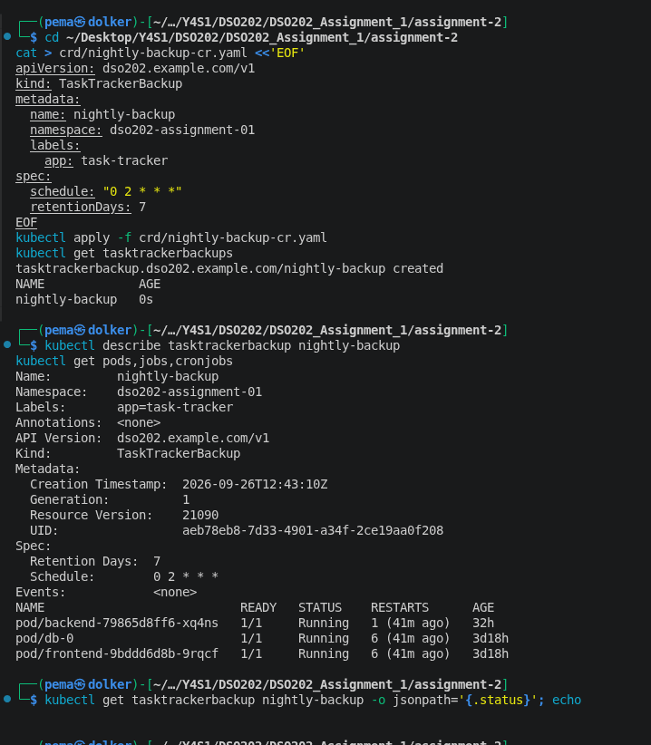

#### 2.4.1.2 Operator lifecycle management

Once a real Operator exists, it still needs installing, upgrading, and having its own permissions reviewed like any other workload — in some ecosystems (Red Hat OpenShift particularly) that's handled by a separate tool, Operator Lifecycle Manager (OLM). I didn't install OLM here; it's a whole additional system for managing Operators, and the lecture notes only name it as something worth being aware of, not something this unit expects hands-on. What I can point to instead is the exact stage OLM exists to manage — my own `TaskTrackerBackup` sitting there with a CRD installed and genuinely nothing watching it is precisely the starting point every real Operator install begins from, before the controller Deployment ever gets applied.

### 2.4.2 Creating custom operators

#### 2.4.2.1 Operator SDK

Operator SDK (and Kubebuilder) generate the CRD scaffolding, the watch/informer/workqueue plumbing, and the RBAC manifests an Operator needs, so the author writes the reconciliation logic and not much else. I didn't use it — writing a real Operator with it is explicitly beyond this unit's scope per the lecture notes — but it connects directly back to something I did build: the aggregated ClusterRole in 2.3.1.2 is exactly the kind of thing Operator SDK would generate automatically for a real `TaskTrackerBackup` Operator. I hand-wrote it here to understand what it actually does; a real Operator author mostly wouldn't.

#### 2.4.2.2 Writing controllers for custom resources

I didn't write a real controller, but I can describe precisely what one for `TaskTrackerBackup` would need to do, based on the reconcile loop from the lecture notes:

```text
function reconcile(taskTrackerBackup):
    desired = taskTrackerBackup.spec                       # schedule, retentionDays
    current = getExistingResourcesFor(taskTrackerBackup)    # any CronJob already created

    if current.cronJob is missing:
        createCronJob(desired.schedule)                     # runs pg_dump against db-svc
    else if current.cronJob.schedule != desired.schedule:
        updateCronJobSchedule(desired.schedule)

    pruneBackupsOlderThan(desired.retentionDays)             # application-specific, not built into K8s
    updateStatusCondition(taskTrackerBackup, observedGeneration=...)
```

The part the notes are firm about, and that actually makes sense once I sat with it: this has to be level-based, comparing "what does the spec ask for right now" against "what actually exists right now," not "what specifically just changed." My own `nightly-backup` object sat there with an empty status for as long as I left it — a real controller has to be safe to restart, miss an update entirely, or rebuild its whole cache from nothing, and still land on the correct state on its very next pass. Trying to track "what changed" instead of "what should exist" is exactly the kind of thing that breaks the moment a controller restarts at the wrong moment.

### 2.4.3 Examples of popular operators

This connects straight back to the call I made in 2.1: keeping `db` at 1 replica because the plain `postgres` image can't coordinate multiple copies of itself, which I proved directly with the independent-data test. A real Postgres operator — **CloudNativePG** or the **Zalando Postgres Operator** are the two commonly used ones — is what actually closes that gap. Underneath, it still manages a StatefulSet, the exact object type I hand-built in 2.1, but adds the application-specific knowledge a bare StatefulSet doesn't have on its own: electing a primary among replicas, setting up real streaming replication so the replicas actually stay in sync, automatic failover if the primary dies, and scheduled backups — which my own stripped-down `TaskTrackerBackup` CRD was standing in for, without any of the controller logic actually behind it. The **Prometheus Operator** is the other well-known example, managing Prometheus and Alertmanager through its own CRDs (`Prometheus`, `ServiceMonitor`), which I'll meet properly in Unit V rather than here.

## Problems encountered and how I actually worked through them

- **`FailedMount` and a slow image pull on the Ingress controller.** Covered under 2.2.2.1 — neither was a real fault, both resolved once I checked the actual events instead of just re-running the command.
- **StatefulSet scaling hit my own A1 quota, twice.** Covered under 2.1.4 — first PVCs, then memory limits, and I had to force a reconcile with a scale-down/scale-up nudge since the StatefulSet controller doesn't watch the quota object itself.
- **`crd/` directory didn't exist the first time I tried to write the CRD file.** `mkdir -p crd` fixed it — a small thing, but it's the kind of error worth actually reading rather than just retrying blind.
- **Tested `api.tasktracker.local/status` before realising the real route is `/api/status`.** Caught it myself from the "Cannot GET /status" response and corrected it — a genuine mistake, not a routing bug.
- **Fresh cluster, wrong kubectl namespace.** After recreating the cluster for Ingress, `kubectl get pods` came back empty because the earlier `set-context --current --namespace=...` shortcut doesn't carry over to a brand-new cluster — needed setting again.

## Limitations

- The database is still a single replica in the version I'm actually running; the 3-replica StatefulSet behaviour is demonstrated deliberately, then scaled back down, rather than kept running, because a real 3-replica setup needs an actual operator (2.4.3) to be meaningful rather than just possible.
- TLS is self-signed, since there's no real domain for a kind cluster — a real deployment would use cert-manager and a real CA, which the lecture notes name directly as standard practice.
- `TaskTrackerBackup` is a CRD with no controller behind it. That's deliberate for this assignment (2.4.1.1), not something I ran out of time to finish — writing the actual controller is explicitly named in the lecture notes as beyond this unit's scope.
- The backend's RBAC permissions (read-only on Pods) aren't used by the application itself today; they exist to demonstrate the mechanism honestly, as I said in 2.3.1.1, not because the app currently needs Kubernetes API access.

## Use of AI

Same as A1: I used Claude while working on this, to explain the Unit II concepts properly before building anything, to help draft and check the manifests, to troubleshoot the errors as they came up (the quota walls, the Ingress webhook timing, the CSR signer requirements), and to help structure this report against the module descriptor's own topic list since no formal brief was given. Every command was run by me, on my own cluster, and the screenshots are from those actual runs.